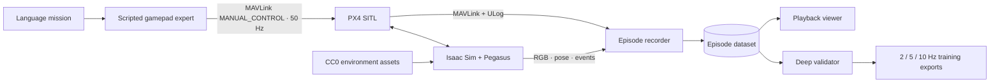

# VLN Simulations

Simulation-first data generation for language-conditioned UAV control. This repository contains the reproducible proof of concept behind **Natural Valley v2**: ten autonomous PX4 missions in a rich Isaac Sim mountain environment, recorded as synchronized RGB observations, gamepad-level actions, vehicle state, MAVLink telemetry, and native PX4 logs.

**Live dataset playback:** [ap.yc2.io:8787](http://ap.yc2.io:8787)

## What is included

- a 1.3 km-square high-detail collision valley inside a 4.8 km visual terrain envelope, with a continuous river, ridges, vegetation, rocks, cliffs, and task landmarks;
- 18 pinned, locally cached Poly Haven CC0 assets with retained provenance and hashes;
- ten distinct natural-language missions covering reconnaissance, search, inspection, mapping, imaging, and long-range patrol;
- a scripted expert that emits human-gamepad-level `roll`, `pitch`, `yaw`, and `throttle` through PX4 `MANUAL_CONTROL`;
- 10 Hz forward RGB and 50 Hz action/state recording, plus aligned 2/5/10 Hz JSONL exports;
- an explicit 5 km RGB far plane, conservative instance bounds, and background forest bands that prevent outdoor geometry pop-in;
- deep validation of images, timing, checksums, mission completion, MAVLink logs, ULogs, and training exports;
- an interactive browser viewer with synchronized frames, controls, telemetry, routes, and the actual deterministic scene objects.

The current horizon- and launch-pad-fixed PoC contains 18,968 RGB frames, 96,642 actions, 32.4 minutes of simulated flight, and 6.36 km of trajectories. See the [dataset card](docs/dataset-card.md) for complete statistics.

## System



The VLM-facing action space intentionally sits above low-level motor control. PX4 remains responsible for stabilization; the expert represents the joystick-level decisions that a future learned policy should predict.

## Repository layout

```text
simulation/
  generate_episode.py   one-episode simulator, expert, recorder, and exporter
  natural_valley.py     environment, deterministic asset scatter, and missions
  fetch_assets.py       pinned Poly Haven downloader and provenance manifest
  validate_dataset.py   dataset-wide deep validator
scripts/
  run_batch.sh          resumable ten-episode GPU batch
  benchmark_l40s.sh          Docker L40S preflight and one-episode benchmark
  benchmark_native_l40s.sh   native Linux L40S preflight and benchmark
  serve_viewer.sh       read-only playback deployment
viewer/                 Flask + Canvas playback application
configs/example.env     configurable AP/runtime paths
docs/                   environment design, dataset card, and roadmap
```

## Requirements

- Linux host with an NVIDIA GPU and Docker GPU support
- NVIDIA Isaac Sim 5.1.0 container image
- Pegasus Simulator 5.1.0
- PX4 Autopilot v1.14.3 built for SITL
- approximately 2 GB for the PoC dataset and reusable asset pack

The current AP deployment keeps heavyweight runtime dependencies and datasets outside Git:

```text
RUNTIME_ROOT/
  PegasusSimulator/
  PX4-Autopilot/
  isaac-python-deps/
DATA_ROOT/
  assets/polyhaven-v2/
  datasets/natural-valley-v2/
  isaac-cache/
```

## Check and benchmark an L40S host

An L40S has the RT cores and 48 GB of VRAM needed for Isaac Sim rendering, but a GPU alone is not enough to run these missions. Use an x86_64 Linux host with a working NVIDIA driver, Docker GPU access, and the [Isaac Sim 5.1.0 container requirements](https://docs.isaacsim.omniverse.nvidia.com/5.1.0/installation/requirements.html). This repository does not install Isaac Sim, Pegasus, PX4, or the Python dependencies for you.

First, check the selected GPU and run Isaac Sim's compatibility checker. This pulls the container image if necessary; it does not require Pegasus or PX4:

```bash
bash scripts/benchmark_l40s.sh --preflight-only
```

To benchmark the **actual simulation**, prepare `RUNTIME_ROOT` with Pegasus Simulator 5.1.0, a PX4 v1.14.3 SITL build, and `isaac-python-deps` as shown above. Create writable `DATA_ROOT`, then set both paths and the GPU index in `.env`:

```bash
cp configs/example.env .env
# Edit RUNTIME_ROOT, DATA_ROOT, and GPU_DEVICE in .env.
bash scripts/benchmark_l40s.sh
```

The script runs one fresh Natural Valley mission through Isaac Sim, Pegasus, and PX4. It downloads missing scene assets, checks that the mission produced RGB frames, actions, and PX4/MAVLink logs, and writes `summary.json`, the simulator log, and one-second GPU samples under `DATA_ROOT/benchmarks/`. The summary reports end-to-end wall time, simulated time, real-time factor, RGB frames per wall second, and sampled peak GPU use and VRAM. A passing compatibility check alone does not verify mission completion. The first mission may spend substantial time downloading assets and warming renderer caches, so compare repeated runs on similarly prepared machines.

### Run the same benchmark without Docker

Install [Isaac Sim 5.1.0 natively on Linux](https://docs.isaacsim.omniverse.nvidia.com/5.1.0/installation/install_workstation.html), along with the same Pegasus, PX4, and Python dependencies. Set `ISAAC_ROOT` to the installation containing `python.sh`, or set `ISAAC_PYTHON` to the executable Python interpreter of an Isaac Sim 5.1 environment. Keep `RUNTIME_ROOT`, `DATA_ROOT`, and `GPU_DEVICE` in `.env` as above. The native preflight starts Isaac Sim headlessly; the full benchmark runs a new mission and produces the same measurements:

```bash
export ISAAC_ROOT=/absolute/path/to/isaac-sim
bash scripts/benchmark_native_l40s.sh --preflight-only
bash scripts/benchmark_native_l40s.sh
```

`GPU_DEVICE` selects the physical GPU index reported by `nvidia-smi`. Run only one native mission at a time on the host, since PX4/MAVLink ports are not isolated by containers.

## Generate the dataset

Copy the example configuration and point it at the prepared runtime and bulk-storage locations:

```bash
cp configs/example.env .env
set -a
source .env
set +a
./scripts/run_batch.sh
```

The command is fully unattended and resumable. It downloads missing assets, selects the requested GPU, skips already-successful episodes, retries episode failures, validates the complete dataset, and exits nonzero if any quality gate fails.

Generate one episode directly with Isaac Sim's Python interpreter:

```bash
/isaac-sim/python.sh simulation/generate_episode.py \
  --scene-version v2 \
  --assets-root /data/assets/polyhaven-v2 \
  --output-root /data/datasets/natural-valley-v2 \
  --px4-dir /runtime/PX4-Autopilot \
  --episode-id 0 \
  --seed 5200
```

## Inspect the result

```bash
DATASET_ROOT=/mnt/frtn/uav-sim/datasets/natural-valley-v2 \
PORT=8787 \
./scripts/serve_viewer.sh
```

Open `http://HOST:8787`. The mission map reconstructs the same episode-seeded river, trees, groundcover, rocks, debris, rockslide, cliffs, and landmarks used by the simulator—not a decorative approximation.

## Download the ten-mission sample

The original `natural-valley-v2` PoC is published as a compressed [GitHub Release](https://github.com/YerevaNN/VLN-Simulations/releases/tag/v0.1.0), outside Git history. It predates the horizon and launch-pad fixes; the live AP viewer uses `natural-valley-v2-launch-fixed`. Download, verify, and extract the original sample with:

```bash
./scripts/download_sample_data.sh
```

The archive is approximately 919 MiB compressed and 1.24 GiB extracted. Its pinned SHA-256 checksum is tracked in [`checksums/natural-valley-v2-sample.sha256`](checksums/natural-valley-v2-sample.sha256).

## Data contract

Every `episode-NNN` contains:

- `mission.json` and `manifest.json`;
- JPEG RGB frames plus `frames.parquet` timestamps;
- `joystick.parquet`, `vehicle_state.parquet`, and `events.parquet`;
- `mavlink.tlog` and `px4.ulg`;
- aligned `exports/{2,5,10}hz.jsonl` views.

Large datasets, downloaded assets, runtime checkouts, and simulator caches are deliberately excluded from Git.

## Scope and limitations

This is a proof of concept for data-pipeline development and small training experiments. The simulated articulation is an Iris-derived X500 v2-class proxy, not yet an exact Holybro X500 v2 model. Water and vegetation are static, terrain is curated rather than surveyed, and the expert has not yet been calibrated against human demonstrations. Simulation output must not be treated as evidence of real-world flight safety.

## License and assets

Repository code is released under the [Apache License 2.0](LICENSE). Downloaded Poly Haven assets are not committed; they are obtained from their original source under [CC0 1.0 Universal](https://polyhaven.com/license), with attribution and provenance retained in the generated asset manifest.
