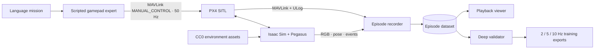

# VLN Simulations

Simulation-first data generation for language-conditioned UAV control. This repository contains the **Natural Valley** PX4/Isaac simulation pipeline and its historical ten-flight v2 sample. The current generator produces contract-checked navigation demonstrations, records live gamepad commands and their simulated outcomes, and publishes only independently validated attempts. The historical sample predates the engineering changes documented below.

**Live dataset playback:** [ap.yc2.io:8787](http://ap.yc2.io:8787)

## What is included

- a 1.3 km-square high-detail collision valley inside a 4.8 km visual terrain envelope, with a continuous river, ridges, vegetation, rocks, cliffs, and task landmarks;
- 18 pinned, locally cached Poly Haven CC0 assets with retained provenance and hashes;
- ten navigation mission families with scene-bound targets, ordered routes, closed orbits, bridge clearance and stable landing predicates;
- a scripted expert that emits human-gamepad-level `roll`, `pitch`, `yaw`, and `throttle` through PX4 `MANUAL_CONTROL`;
- 10 Hz forward RGB capture timestamps, 50 Hz live command/state recording, and explicit aligned 2/5/10 Hz exports with future command chunks;
- an explicit 5 km RGB far plane, conservative instance bounds, and background forest bands that prevent outdoor geometry pop-in;
- independent validity and mission-outcome checks, including images, timing, checksums, route/landing evidence, PX4 received commands and observed flight mode;
- a paginated, chunked playback viewer using recorded scene inventories for new episodes and visibly labeled approximate maps for historical episodes.

The preserved historical horizon- and launch-pad-fixed PoC contains 18,968 RGB frames, 96,642 actions, 32.4 minutes of simulated flight, and 6.36 km of trajectories. See the [dataset card](docs/dataset-card.md) for complete statistics.

The proposed production-scale successor targets 10,000 accepted flight hours across approximately 100,000-120,000 episodes, multiple simulators, rich onboard sensors, dynamic agents, and held-out environment families. See the [10K-hour scale plan](docs/scale-plan.md). Implementation decisions, tests and remaining challenges are in [engineering notes](docs/engineering-notes.md); generation operations are in [batch generation and recovery](docs/batch-generation.md).

## System



The VLM-facing action space intentionally sits above low-level motor control. PX4 remains responsible for stabilization; the expert represents the joystick-level decisions that a future learned policy should predict.

## Repository layout

```text
simulation/
  generate_episode.py   one-episode simulator, expert, recorder, and exporter
  natural_valley.py     environment, deterministic asset scatter, and missions
  fetch_assets.py       pinned Poly Haven downloader and provenance manifest
  validate_dataset.py   dataset-wide deep validator
scripts/
  run_batch.sh          resumable ten-episode GPU batch
  serve_viewer.sh       read-only playback deployment
viewer/                 Flask + Canvas playback application
configs/example.env     configurable AP/runtime paths
docs/                   environment design, dataset card, scale plan, and roadmap
```

## Requirements

- Linux host with an NVIDIA GPU and Docker GPU support
- NVIDIA Isaac Sim 5.1.0 container image
- Pegasus Simulator 5.1.0
- PX4 Autopilot v1.14.3 built for SITL
- approximately 2 GB for the PoC dataset and reusable asset pack

The current AP deployment keeps heavyweight runtime dependencies and datasets outside Git:

```text
RUNTIME_ROOT/
  PegasusSimulator/
  PX4-Autopilot/
  isaac-python-deps/
DATA_ROOT/
  assets/polyhaven-v2/
  datasets/natural-valley-v2/
  isaac-cache/
```

## Generate the dataset

Copy the example configuration and point it at the prepared runtime and bulk-storage locations:

```bash
cp configs/example.env .env
set -a
source .env
set +a
./scripts/run_batch.sh
```

The command verifies the pinned assets, fingerprints code/runtime/configuration, claims each episode, records private attempts and atomically publishes validated successes. Resume requires a matching publication receipt and revalidation. Existing datasets are never overwritten; use a new dataset name for changed configurations. Failed attempts and cost measurements are preserved. See [batch generation](docs/batch-generation.md) for sharding, timeouts and recovery.

Generate one episode directly with Isaac Sim's Python interpreter:

```bash
/isaac-sim/python.sh simulation/generate_episode.py \
  --scene-version v2 \
  --assets-root /data/assets/polyhaven-v2 \
  --output-root /data/datasets/natural-valley-v2 \
  --px4-dir /runtime/PX4-Autopilot \
  --episode-id 0 \
  --seed 5200
```

## Inspect the result

```bash
DATASET_ROOT=/mnt/frtn/uav-sim/datasets/natural-valley-v2 \
PORT=8787 \
./scripts/serve_viewer.sh
```

Open `http://HOST:8787`. New episodes export the authored scene inventory used by the mission map. Historical episodes lack this artifact and display a clearly labeled legacy approximation.

## Download the ten-mission sample

The original `natural-valley-v2` PoC is published as a compressed [GitHub Release](https://github.com/YerevaNN/VLN-Simulations/releases/tag/v0.1.0), outside Git history. It predates the horizon and launch-pad fixes; the live AP viewer uses `natural-valley-v2-launch-fixed`. Download, verify, and extract the original sample with:

```bash
./scripts/download_sample_data.sh
```

The archive is approximately 919 MiB compressed and 1.24 GiB extracted. Its pinned SHA-256 checksum is tracked in [`checksums/natural-valley-v2-sample.sha256`](checksums/natural-valley-v2-sample.sha256).

## Data contract

Every `episode-NNN` contains:

- `mission.json`, `manifest.json`, authored `scene_inventory.json`, and independent `mission_evaluation.json` for new generation;
- JPEG RGB frames plus `frames.parquet` timestamps;
- `joystick.parquet`, `vehicle_state.parquet`, and `events.parquet`;
- `mavlink.tlog` and `px4.ulg`;
- aligned `exports/{2,5,10}hz.jsonl` views;
- a publication receipt after successful batch validation.

Use `scripts/pack_dataset.py` for immutable indexed archive shards and `scripts/report_capacity.py` for measured attempt costs or explicitly labeled historical scenarios. See their `--help` output and the [viewer/archive notes](viewer/README.md).

Large datasets, downloaded assets, runtime checkouts, and simulator caches are deliberately excluded from Git.

## Scope and limitations

This is a proof of concept for data-pipeline development and small training experiments. The simulated articulation is an Iris-derived X500 v2-class proxy, not yet an exact Holybro X500 v2 model. Water and vegetation are static, terrain is curated rather than surveyed, and the expert has not yet been calibrated against human demonstrations. Simulation output must not be treated as evidence of real-world flight safety.

## License and assets

Repository code is released under the [Apache License 2.0](LICENSE). Downloaded Poly Haven assets are not committed; they are obtained from their original source under [CC0 1.0 Universal](https://polyhaven.com/license), with attribution and provenance retained in the generated asset manifest.
