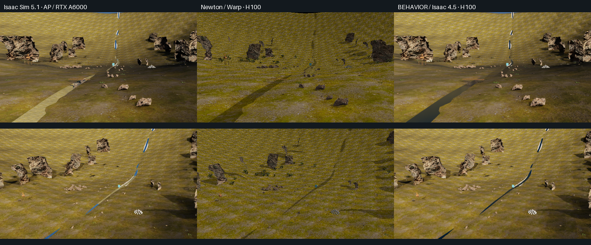

# Rendering results — 6 September 2026

**Isaac Sim 4.5 path tracing produced all 54 images on H100, with the requested
OptiX denoising setting enabled, and the six fixed views were nearly
pixel-identical to the same Isaac 4.5 configuration on RTX A6000. Newton/Warp also rendered the full sequence,
but its appearance differs substantially from the RTX reference.** This
establishes a working H100 image path for this scene; it does not establish
full Isaac Sim feature parity or identify the minimum rewrite for every sensor.

## Completed runs

| Run | GPU | Slurm job | Output |
| --- | --- | --- | --- |
| Isaac Sim 5.1, real-time reference | AP RTX A6000 | 246808 | 54 RGB frames + six depth arrays |
| Newton/Warp 1.7 development snapshot | H100 | 246804 | 54 RGB frames + six depth arrays |
| BEHAVIOR 3.7.1 settings, Isaac 4.5 path tracing | H100 | 246811 | 54 RGB frames + six depth arrays |
| Isaac 5.1 path-tracing control | AP RTX A6000 | 246807 | 54 RGB frames + six depth arrays |
| Identical Isaac 4.5 path-tracing control | AP RTX A6000 | 246814 | 54 RGB frames + six depth arrays |

The Isaac 4.5 H100 run used driver 580.173.02. Newton ran on driver 580.105.08;
AP used 580.173.02. All completed runs share exact scene and camera file hashes.
The six view names are identifiers, not verified landmark labels.

## Visual and geometric checks

- For the identical Isaac 4.5 path-tracing configuration, the six H100/AP view
  pairs have mean absolute RGB differences of **0.022–0.027 on the 0–255
  scale**. All jointly valid depth pixels below 500 m agree within 10 cm;
  their median and 95th-percentile absolute depth differences are zero.
  This successful H100 path uses the existing Isaac 4.5 renderer. The
  image/depth difference data are saved in
  [comparison-metrics.json](results/comparison-metrics.json). Pixel differences
  are descriptive, not a general perceptual-quality score or proof of parity.
- Newton is darker and shows strong speckling in these views. Its lighting,
  material support and default far distance differ; the cause of the speckling
  has not been isolated. The near/midrange depth comparison agrees within
  10 cm for 91.3–95.9% of jointly valid pixels, depending on view. Median depth
  differences are approximately 0.01–0.03 mm. This supports camera alignment
  while leaving meaningful visibility/material differences.
- Newton imported 18,796 render shapes after expansion of all 3,019 USD point
  instances. It uses the direct `SensorTiledCamera` backend documented for
  Isaac Lab, not a complete Isaac Lab task environment.

## Failed paths and setup corrections

The tested current BEHAVIOR/Isaac 5.1 real-time path failed with Vulkan device
loss. The 5.1 path-tracing attempts either failed during startup or returned no
image at capture. Isaac 4.5 real-time also failed; its path-tracing override
succeeded. These are results for the recorded versions, drivers and setup,
not a universal statement about every H100 installation.

Early AP runs exposed missing driver artifacts in the Slurm container:
`libnvidia-ngx.so.1` and `nvoptix.bin`. They were copied from the same AP host;
the final reference runs succeeded without the earlier NGX/denoiser errors.
The H100 node already had both artifacts. Other preparation failures included
an unevaluated capture graph and missing Newton USD dependencies. Original
logs and earlier outputs remain outside Git; final evidence uses the corrected
runs. [Slurm accounting](results/slurm-accounting.txt) records each attempt.

## Scope and reproducibility

The subsequent [adversarial material test](STRESS_RESULTS.md) exposes a large
transparency appearance mismatch between real-time and path tracing on A6000.
It also records H100 startup failures and a pending matched-node control;
the valley's agreement should not be generalized to all materials or setups.

The path-tracing override requests four samples per update, a total sample
limit of 256, 32 maximum bounces and OptiX denoising. It is distinct from the
default BEHAVIOR real-time configuration. The scripts record the applied
settings, actual render mode, GPU identity, source commit and input hashes.

This is a static natural-valley scene with camera replay. No physics trajectory,
robot policy, BEHAVIOR household task, LiDAR, radar or dynamic sensor timing was
validated. Capture durations include different settling/sampling work and file
output, so they must not be read as comparable renderer FPS.

Raw frames, depth and logs are under the experiment workspace's `comparison/`
and `logs/` directories. [artifact-index.json](results/artifact-index.json)
records their exact hashes. The interactive viewer is generated by
`make_report.py`; it synchronizes all completed backends and allows selecting
the AP path-tracing controls. See [README.md](README.md) for versions and launch
commands. AP's source working tree and existing hosted viewer were preserved.
